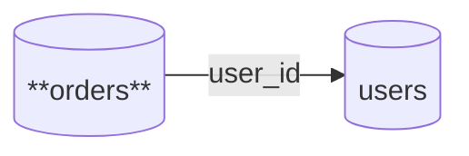

# Table Specification: orders

## Overview

| Item | Value |
|------|-------|
| Schema | public |
| Table Name | orders |
| Description | Table for managing order information |

## Column Definitions

<!--@embedify:table_columns id="orders"-->
| Column Name | Type | NOT NULL | Default | Comment |
| --- | --- | --- | --- | --- |
| id | integer | ✔ | NULL | Order ID |
| user_id | integer | ✔ | NULL | User ID |
| total_amount | decimal(10,2) | ✔ | 0 | Total amount |
| status | varchar(20) | ✔ | 'pending' | Order status |
| created_at | timestamp | ✔ | CURRENT_TIMESTAMP | Created at |
<!--@embedify:end-->

## Table Dependencies

<!--@embedify:table_relations id="orders"-->

<!--@embedify:end-->

## Change History

| Date       | Version | Author  | Description          |
| ---------- | ------- | ------- | -------------------- |
| 2025-12-17 | 1.0.0   | -       | Auto-generated from template |
