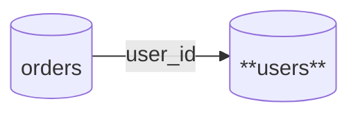

# Table Specification: users

## Overview

| Item | Value |
|------|-------|
| Schema | public |
| Table Name | users |
| Description | Table for managing user information |

## Column Definitions

<!--@embedoc:table_columns id="users"-->
| Column Name | Type | NOT NULL | Default | Comment |
| --- | --- | --- | --- | --- |
| id | integer | ✔ | NULL | User ID |
| name | varchar(100) | ✔ | NULL | User name |
| email | varchar(255) | ✔ | NULL | Email address |
| created_at | timestamp | ✔ | CURRENT_TIMESTAMP | Created at |
| updated_at | timestamp |  | NULL | Updated at |
<!--@embedoc:end-->

## Table Dependencies

<!--@embedoc:table_relations id="users"-->

<!--@embedoc:end-->

## Change History

| Date       | Version | Author  | Description          |
| ---------- | ------- | ------- | -------------------- |
| 2025-12-17 | 1.0.0   | -       | Auto-generated from template |
